<div align="center">
  
  
  # ✨ Singh Cake Delight ✨
  
  **Artisanal Curation • Smart Orchestration • Seamless WhatsApp Delivery**
  
  An elegant, premium, full-stack cake-ordering system designed with custom themes, interactive schedulers, robust database synchronization, and admin control panels.
  
  [](https://reactjs.org/)
  [](https://www.typescriptlang.org/)
  [](https://expressjs.com/)
  [](https://www.sqlite.org/)
  [](https://orm.drizzle.team/)
  [](https://tailwindcss.com/)

  ---
</div>

## 🎨 Visual Identity & Design Aesthetics

Singh Cake Delight is crafted with a meticulous visual system that delivers a warm, comforting, and modern bakery storefront experience.

*   **Colors & Palette (Soft Cream & Warm Bakery Theme)**:
    *   **Light Mode**: Features a soft cream-yellow background (`#FFF9E6`), warm beige cards, and rich dark chocolate text (`#2D1E17`), accented with soft pastel pink (`#FDF2FF`) and golden caramel (`#F59E0B`).
    *   **Dark Mode**: Leans gracefully into a deep dark chocolate theme (`#1F130E` / `hsl(12, 25%, 12%)`) with high-contrast cream labels.
*   **Typography**:
    *   **Display Text**: Elegant `'Playfair Display', serif` for headers and key highlights to reinforce a high-end, premium boutique identity.
    *   **Body Text**: Clean `'DM Sans', sans-serif` to ensure modern, accessible, and fatigue-free reading across components.
*   **Micro-Animations & Delighters**:
    *   **Dynamic Cursor Trail**: Custom `CursorTrail.tsx` canvas renderer that draws a smooth, playful pastel star-trail following mouse movement.
    *   **Transitions**: Smooth page routing transitions and scroll-driven hover effects using `framer-motion`.

---

## ⚙️ Tech Stack

The application uses a modern, highly-integrated TypeScript stack spanning client and server layers:

| Layer | Technology | Key Purpose / Feature |
| :--- | :--- | :--- |
| **Frontend** | React 18 & TypeScript | Type-safe, declarative component architecture. |
| **Routing** | Wouter | Lightweight, fast client-side router with a clean hook-based API. |
| **State & Query** | TanStack React Query (v5) | Automatic caching, request deduplication, and zero-config query invalidation. |
| **Animations** | Framer Motion | Fluid animations, card entry hover layouts, and slide-in panels. |
| **UI Components** | Shadcn UI (Radix Primitives) | Accessible, customizable design building blocks (Popovers, Calendars, Dialogs). |
| **Server Engine** | Express.js (v5) | Handles REST API endpoints, security, and static single-page asset hosting. |
| **Database & ORM** | SQLite / Turso + Drizzle | Dynamic switching between local SQLite (better-sqlite3) and Cloud database (Turso libsql) via Drizzle ORM. |
| **Validation** | Zod & Drizzle-Zod | Strict input validation ensuring fail-safe API payload matching. |
| **Automation** | Nodemailer | Dynamic emails for admin logins, recovery OTPs, and system notifications. |
| **Data Export** | SheetJS (xlsx) | Automatic and manual table synchronization to offline Microsoft Excel spreadsheets. |
| **Security** | Helmet & Express Rate Limit | Enforces strict CSP and rate-limiting rules to prevent spam and Stored XSS. |
| **Build Tools** | Vite & tsx | High-speed bundler and hot-module server execution scripts. |

---

## 🔄 Core Workflows & Logic

```mermaid
flowchart TD
    %% Styling
    classDef default fill:#FFFDF6,stroke:#D946EF,stroke-width:1px,color:#2D1E17;
    classDef actor fill:#FDF2FF,stroke:#D946EF,stroke-width:2px,font-weight:bold,color:#D946EF;
    classDef system fill:#FFF5F5,stroke:#DC2626,stroke-width:1.5px,color:#DC2626;

    subgraph Customer Workflow
        C_Start([Customer Auth]) --> C_Browse[Browse Menu & Gallery]
        C_Browse --> C_Form[Fill Booking Form]
        C_Form --> C_Val{"Validate Schedule<br>(Date >= Today+4 Days & Time 7 AM - 8 PM)"}
        C_Val -- Invalid --> C_Form
        C_Val -- Valid --> C_Save[Save Order & Trigger Auto Excel Sync]
        C_Save --> C_Confirm[Order Submitted Toast]
        C_Confirm --> C_WA[WhatsApp Order Finalization Redirect]
    end

    subgraph Admin Management Loop
        A_Start([Admin Login]) --> A_Alert[Email Security Alert Dispatched]
        A_Alert --> A_Dash[Access Dashboard]
        A_Dash --> A_Manage[Manage Catalog / Gallery Images]
        A_Dash --> A_Orders[Track Live Orders Grid]
        A_Orders --> A_Update[Change Order Status]
        A_Orders --> A_Contact[Contact Customer via Pre-filled WA Link]
        A_Dash --> A_Backup[Sync & Download DB as Excel Spreadsheets]
    end

    class C_Start,A_Start actor;
    class C_Val,A_Alert system;
```



### 1. User & Admin Authentication Flow
*   **Customer Auth**: Standard registration and session-cookie login. Features clean forms with immediate feedback. Includes Google OAuth options.
*   **Admin Shield**: The Admin Dashboard is restricted to a dedicated email. Upon successful authentication:
    *   **Email Alert Dispatch**: The server geolocates the incoming IP address (using IP-API), parses the device User-Agent, formats the timestamps into Indian Standard Time (IST), and emails a stylized security alert to the admin inbox.
    *   **Secure OTP Loop**: Forgotten admin passwords trigger a 6-digit verification code sent via Nodemailer. Once verified, the server hashes the new password using bcrypt/scrypt, updates the database, writes it directly back to the secure `.env` file, and pushes it to active memory.

### 2. Customer Custom Order Scheduling Workflow
*   **Interactive Designer & Form**: Customers can select a standard catalog cake or build a custom layout. They can input customization notes, list requested modifications, and upload a custom image (restricted to `<2MB` base64 format).
*   **Time & Schedule Safeguards**:
    *   **The 4-Day Rule**: The date-picker locks out dates less than **4 days in advance**, giving bakers ample time to source ingredients and prepare custom designs.
    *   **Opening Hours Safeguard**: Order times are strictly verified to fall between **7:00 AM and 8:00 PM**.
*   **Submit & Sync**: Upon submission, the order is registered as `pending` in the SQLite database, which automatically kicks off an background synchronization routine to backup the table to an Excel file.
*   **Redirection to WhatsApp**: The customer receives a success popup and is prompted to click a direct link. This opens a secure WhatsApp thread with the bakery owner, carrying a pre-filled, templated message containing their Order ID, cake request, and pickup date to finalize customization.

### 3. Admin Dashboard Control Loop
*   **Live Order Tracking Grid**: Displayed in a responsive, desktop table and mobile card layout. Admins can view order states, details, custom notes, and click customer references to open an high-fidelity fullscreen image preview overlay.
*   **Status Management**: Admins can change order status (Pending ⇄ Completed) with a single click, or permanently delete requests.
*   **Art Catalog & Gallery Control**: Admins can add, edit, or delete items directly from the catalog (which updates the customer menu in real-time) and manage the home gallery images.
*   **Database Excel Backups & Settings**:
    *   **Auto Sync**: Database updates automatically sync to Excel tables.
    *   **Manual Downloads**: Admins can click a button to download the entire SQLite database file, or export specialized tables as Excel sheets.
    *   **Configuration Manager**: Allows resetting passwords and checking active system logs inside the browser.

### 4. Hybrid Database & Storage Hardening
*   **Dynamic Provider Switching**: The application dynamically determines database connectivity based on environment presence:
    *   **Cloud Mode**: Streams reads/writes via `@libsql/client` when `TURSO_DATABASE_URL` is defined.
    *   **Local Mode**: Auto-falls back to a local SQLite instance utilizing `better-sqlite3`, storing assets inside the custom `DATA_DIR` folder.
*   **Security & Hardening Lockdowns**:
    *   **Restrictive Permissions**: Forces database and helper files (Write-Ahead Logging `-wal` and Shared Memory `-shm`) to strict owner-only access (`0o600` read/write locks).
    *   **Forensic Scrubbing**: Invokes `secure_delete = ON` which overwrites deleted database records and tables with zero blocks to prevent physical disk forensics recovery.
    *   **Volatile Caches**: Confines transient data allocations to RAM (`temp_store = MEMORY`), stopping internal query logs from spilling onto physical hard disks.
    *   **Write-Ahead Logging**: Speeds up database lock recovery and facilitates concurrent queries via `journal_mode = WAL`.

---

## 📂 Project Directory Structure

```text
├── backend/               # Express server implementation
│   ├── auth.ts            # Password hashing, verification, & session cookies
│   ├── db.ts              # SQLite database configuration via Drizzle
│   ├── email.ts           # SMTP Nodemailer configs & local audit logging fallback
│   ├── excel.ts           # Spreadsheet export & sync logic (SheetJS)
│   ├── index.ts           # Global server setup, CSP (Helmet), & static file router
│   ├── migration.ts       # Database migrations & structure initialization
│   ├── routes.ts          # API Endpoints (Auth, Orders, Products, OTP, Metrics)
│   ├── static.ts          # Production asset serving configuration
│   └── storage.ts         # SQL database query interface & repository layer
├── shared/                # Code shared between frontend and backend
│   ├── schema.ts          # Database tables, Drizzle definitions, & Zod schemas
│   └── routes.ts          # Client-Server API route constant definitions
├── frontend/              # Single Page Application frontend
│   ├── public/            # Static assets (images, icons, vectors)
│   ├── src/
│   │   ├── components/    # Reusable React components
│   │   │   ├── ui/        # Accessible Radix primitives customized for the bakery theme
│   │   │   ├── Navbar.tsx # Glassmorphism navigation bar
│   │   │   ├── Footer.tsx # Footer structure
│   │   │   └── CursorTrail.tsx # Canvas mouse trailing animation
│   │   ├── hooks/         # Custom React hooks (theming, state queries)
│   │   ├── lib/           # Helper scripts (Tailwind merger, API client queries)
│   │   ├── pages/         # Full-page views
│   │   │   ├── Home.tsx   # Public boutique showcase, catalog, & booking form
│   │   │   ├── Admin.tsx  # Order console, catalog, & db actions
│   │   │   ├── Auth.tsx   # Login, registration, & OTP interfaces
│   │   │   └── not-found.tsx # Custom 404 handler
│   │   ├── index.css      # Core tailwind directives, CSS variables, & design tokens
│   │   └── main.tsx       # SPA bootstrap entrypoint
│   └── index.html         # Frontend main mounting index
├── drizzle.config.ts      # Drizzle migration parameters & schemas mapping
├── tailwind.config.ts     # Styling layout custom metrics, extensions & animations
└── package.json           # Package manifests & scripts
```

---

## 🚀 Installation & Local Development

### Prerequisites
*   Node.js (v18 or higher)
*   npm or yarn

### 1. Environment Configuration
Create a `.env` file in the root directory:
```env
# Administrative Password
ADMIN_PASSWORD=your_secure_password_here

# Local SQLite Storage Directory (defaults to workspace root if omitted)
DATA_DIR=./.local

# Cloud Turso Credentials (optional; falls back to local SQLite if omitted)
TURSO_DATABASE_URL=libsql://your-database-name.turso.io
TURSO_AUTH_TOKEN=your_turso_token_here

# SMTP Email Configuration (optional; logs to sent_emails.log if omitted)
SMTP_HOST=smtp.gmail.com
SMTP_PORT=587
SMTP_USER=your_email@gmail.com
SMTP_PASS=your_app_password
EMAIL_FROM=singhcakedelight1981.official@gmail.com
```
> [!NOTE]
> If SMTP environment variables are left empty, the server will gracefully fall back to local file logging. All emails (e.g., OTP codes, login alerts) will be logged to [sent_emails.log](file:///d:/ASHISH%20GITHUB/SINGH-CAKE-DELIGHT/sent_emails.log) inside the project root for local testing.

### 2. Installation
Install project dependencies:
```bash
npm install
```

### 3. Database Push
Push your schema changes and initialize the SQLite database:
```bash
npm run db:push
```

### 4. Running the Development Server
Launch the full-stack development environment (Vite HMR + Express server):
```bash
npm run dev
```
Open your browser and navigate to `http://localhost:5000` to preview the site.

---

## 📦 Production Deployment

### Build the Assets
Compile the React frontend bundle and build the backend server:
```bash
npm run build
```

### Start the Server
Run the production bundle:
```bash
npm start
```
The server will boot up in production mode, serving pre-rendered assets with optimized cache configurations.